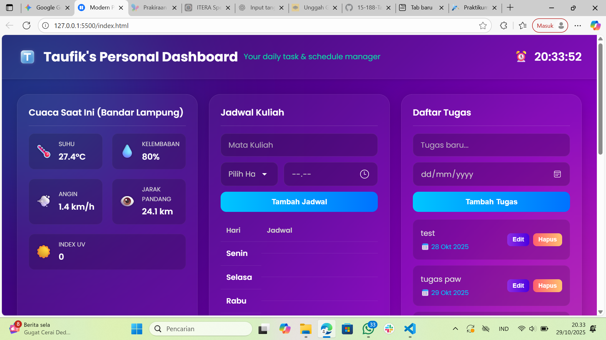

# Taufik's Personal Dashboard

## 🚀 Demo Langsung (Live Demo)

[**Lihat Live Demo Disini**](https://<username-github-anda>.github.io/<nama-repositori-anda>/)

*(Ganti `<username-github-anda>` dan `<nama-repositori-anda>` dengan URL GitHub Pages Anda setelah di-deploy)*

---

## 📖 Deskripsi Proyek

**Taufik's Personal Dashboard** adalah aplikasi web front-end yang dirancang sebagai pusat kendali pribadi untuk mengelola aktivitas harian. Aplikasi ini membantu pengguna melacak jadwal kuliah, mengelola daftar tugas dengan deadline, dan menyimpan catatan singkat, semuanya dalam satu antarmuka yang modern dan interaktif.

Dibuat dengan estetika **Glassmorphism**, dashboard ini mengutamakan tampilan minimalis, efek *frosted glass*, dan interaksi pengguna yang mulus untuk pengalaman yang memuaskan secara visual.

---

## ✨ Fitur-fitur Utama

Aplikasi ini dibangun dengan JavaScript ES6+ modern dan memanfaatkan `localStorage` untuk persistensi data.

### Fungsionalitas Inti
* **CRUD Interaktif:** Semua widget (Tugas, Jadwal, Catatan) mendukung fungsionalitas **Tambah**, **Edit** (langsung dari list), dan **Hapus** data.
* **Penyimpanan Lokal:** Seluruh data Anda (tugas, jadwal, catatan) disimpan dengan aman di `localStorage` browser, sehingga data tidak akan hilang saat Anda me-refresh atau menutup halaman.
* **Manajemen Tugas (To-Do List):**
    * Menambahkan tugas baru lengkap dengan **deadline (tanggal)**.
    * **Pengurutan Otomatis:** Daftar tugas secara otomatis diurutkan berdasarkan deadline terdekat, memastikan Anda fokus pada prioritas utama.
    * Tandai tugas sebagai "selesai" dengan satu klik.
* **Manajemen Jadwal Kuliah:**
    * Menambahkan jadwal mata kuliah berdasarkan **Hari** (Senin-Minggu) dan **Waktu**.
    * **Tampilan Tabel Mingguan:** Jadwal yang baru ditambahkan akan secara otomatis masuk ke dalam sel tabel hari yang sesuai, memberikan gambaran jadwal mingguan yang jelas.
* **Widget Catatan:** Fungsionalitas sederhana untuk menambah dan menghapus catatan singkat, lengkap dengan judul dan isi.
* **Widget Cuaca (Async):**
    * Mengambil data cuaca *real-time* dari API publik (Open-Meteo) untuk lokasi Jakarta.
    * Menampilkan 5 data detail: **Suhu**, **Kelembaban**, **Kecepatan Angin**, **Jarak Pandang**, dan **Indeks UV**.

### Antarmuka Pengguna (UI/UX)
* **Desain Glassmorphism:** Efek *frosted glass* modern pada header, card, dan input.
* **Header Personal:** Dilengkapi dengan logo kustom (`T.png`) dan deskripsi teks beranimasi (berkedip warna-warni).
* **Jam Real-Time:** Menampilkan jam, menit, dan detik yang terus diperbarui di header.
* **Card Interaktif (Collapsible):** Semua widget disajikan sebagai "card" yang dapat di-klik untuk dibuka atau ditutup, menjaga tampilan tetap rapi dan minimalis.
* **Notifikasi Pop-up:** Memberikan umpan balik visual yang jelas saat data berhasil ditambah, diedit, atau dihapus.
* **Desain Responsif:** Tata letak dashboard menggunakan CSS Grid yang beradaptasi dengan berbagai ukuran layar.

---

## 🛠️ Teknologi yang Digunakan

Proyek ini dibangun dari awal (vanilla) tanpa menggunakan *framework* atau *library* eksternal.

* **HTML5** (Struktur Semantik)
* **CSS3** (Styling, Animasi `@keyframes`, CSS Grid, Flexbox, Glassmorphism)
* **JavaScript (ES6+):**
    * Manipulasi DOM
    * Arrow Functions (`=>`)
    * `let` / `const`
    * Template Literals
    * Classes (untuk model data `Tugas`, `Jadwal`, `Catatan`)
    * Async/Await (untuk `fetch` API cuaca)
    * Manajemen `localStorage`

---

## 📦 Cara Menjalankan & Deploy

Proyek ini murni *front-end* dan tidak memerlukan proses *build*.

**Untuk Menjalankan Secara Lokal:**
1.  Clone repositori ini.
2.  Buka file `index.html` langsung di browser pilihan Anda.

**Untuk Deploy ke GitHub Pages:**
1.  Pastikan semua file (`index.html`, `style.css`, `script.js`, `T.png`, `screenshot.png`) berada di *root* repositori Anda.
2.  Buka **Settings** repositori GitHub Anda.
3.  Pilih **Pages** dari menu di sebelah kiri.
4.  Pada bagian **Build and deployment**, di bawah **Source**, pilih **Deploy from a branch**.
5.  Pilih branch `main` (atau `master`) dan folder `/(root)`.
6.  Klik **Save**. Halaman Anda akan tersedia di URL yang tertera setelah beberapa saat.
